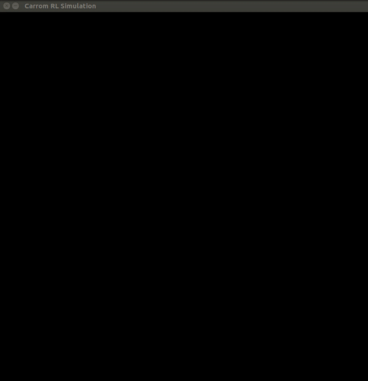
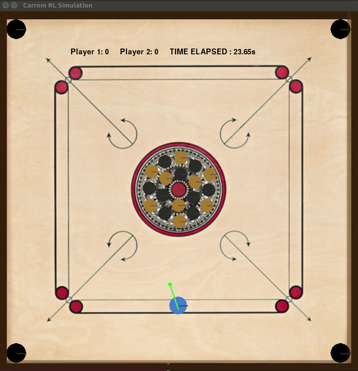
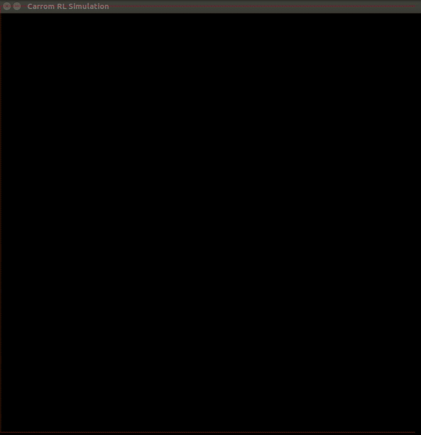
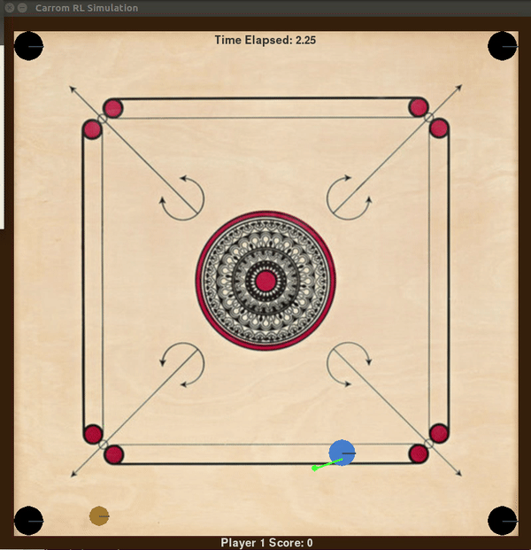
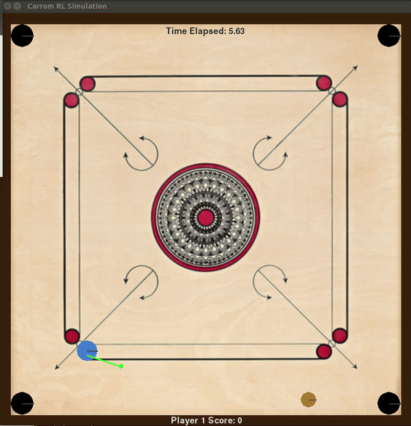

Carrom_rl
=========

An open source Carrom Simulator interface for testing intelligent/learning agents.

[](https://gitter.im/Carrom_rl/Lobby?utm_source=badge&utm_medium=badge&utm_campaign=pr-badge&utm_content=badge)
[](http://www.gnu.org/licenses/gpl-3.0)


## Introduction

This is the 1.0 release of Carrom_rl - A Carrom Simulator, which provides an interface that allows you to design agents that that play carrom. It is built in python, using pygame + pymunk. This is the course project for [CS 747 - Foundations of Intelligent and Learning Agents](https://www.cse.iitb.ac.in/~shivaram/teaching/cs747-a2016/index.html), taught by [Prof. Shivaram Kalyanakrishnan](https://www.cse.iitb.ac.in/~shivaram/) at IIT Bombay.

Bugs can be reported [here](https://github.com/samiranrl/Carrom_rl/issues).
Feedback is welcome. Enjoy!

## Carrom


Image Source: https://i.ytimg.com/vi/LvryHWCgK0s/maxresdefault.jpg

The high-level objective is to use a striker disk with a flick of the finger to sink the lighter carrom men/coins, into one of the corner pockets. A carrom set contains 19 coins in three distinct colors: 9 white and 9 black corresponding to player 1 and player 2 respectively, and red for the queen. To win, you must pocket your own nine coins and the queen before your opponent. (The first player may only pocket white)

The full description and list of rules and regulations can be found at http://www.carrom.org/

### Why Carrom? 

It is a challenging domain:

- The state space is continuous
- The action space is continuous, with added noise
- The agent must adhere to the rules of carrom
- In the two-player case, the agent must plan a strategy against an adversary, a multi-agent system.

## Rules
We slightly modify the rules of the game.

### Single Player



The goal of single player carrom is to design an agent that clears the board as fast as possible, adhering to the following rules:

- The player is allowed to pocket white and black coins. Each coin pocketed increases your score by 1.
- You cannot pocket the queen unless you have pocketed another coin.
- The queen must be pocketed before the last coin.
- If all the coins are pocketed except the queen, one of the coins is taken out of the pocket and put in the center.
- After pocketing the queen, you must sink one of your pieces, thereby 'covering' it, into any pocket in the next shot, or she is returned to the center spot.
- If you pocket the queen along with another of your own piece, it is covered by default.
- A covered queen will increase your score by 3 points
- If the striker goes into the pocket, it counts as a foul. All the pocketed coins that turn are placed in the center. The score does not increase.

The simulation displays the current score of the player, and the time elapsed since the server was initialized.

### Doubles



The goal of doubles is to design an agent, that wins against an opponent in a game of carrom, adhering to the following rules:

- The player to start/break must target white coins only. The other player must target black. Players' score increases by 1 if they pocket their own coin. 
- You cannot pocket the queen unless you have pocketed another coin.
- You get to strike in alternate turns unless you pocket the queen(see below)[Will be changed]
- If the player pockets the opponent's coin, it counts as a foul. All coins pocketed that turn are kept in the center, and the score does not increase.
- If all the coins are pocketed except the queen, the other player wins the match.
- If you manage to pocket all of your own coins, and the opponent pockets and covers the queen, you win the match.
- After pocketing the queen, you must sink one of your pieces, thereby 'covering' it, into any pocket in the next shot, or she is returned to the center spot.
- If you pocket the queen along with another of your own piece, it is covered by default.
- A covered queen will increase your score by 3 points
- If the striker goes into the hole, it counts as a foul. All the pocketed coins in that turn are placed in the center. The score does not increase.

The simulation displays the current score of player 1 and player 2, and the time elapsed since the server was initialized.

## The agent and the environment

We formally define the carrom environment in the reinforcement learning context.

### State

The State is a list of current coin positions (x,y) coordinates returned to the user, and the current score of the player. If a coin is not present, it is assumed to be pocketed in one of the previous strikes. The state also includes the current score of the player. An example of the state is:

```
"State={'White_Locations': [(400,368),(437,420), (372,428),(337,367), (402,332), (463,367), (470,437), (405,474), (340,443)], 'Red_Location': [(400, 403)], 'Score': 0, 'Black_Locations': [(433,385),(405,437), (365,390), (370,350), (432,350), (467,402), (437,455), (370,465), (335,406)]}"
```

It is returned in the form of a string to the agent, which must be parsed. The logic for parsing such a state is built in the sample agent for your reference. 

### Action

The action is a three dimentional vector: [position,angle,force]

- position: The legally valid x position of the striker on the board. Accepts floats in the range 0-1 (normalized, including boundaries). 0 is the extreme left legal position, and 1 is the extreme right. 
- angle : The angle gives the direction (in degrees), where you want to hit the striker. Accepts floats in the range -45 to 225 (including boundaries)
- force: The fractional force with which you want to hit the striker. Accepts floats between 0-1 (normalized, including boundaries). The maximum force makes the striker cover a distance of 3.5 times the width of the board, starting from the center at an angle of 0, striking the walls 4 times, and touching nothing else. There is a minimum force with which you strike (even if you pass 0)

The following examples demonstrate some shots you can perform:

[0.5,72, 0.7] |[0.75,200,0.3] |  [0,-18,0.7]
------------ | -------------  | -------------
||

### Server Rules

- If a certain parameter of an action is out of range, the server generates the parameter uniformly at random in the legal range.
- If the coin overlaps with the striker in the initial placement, the server generates a uniformly random free position.
- For single player, the server permits a maximum of 200 strikes. If the agent does not manage to clear the board, the game is treated as incomplete, and the log file is not written.
- The server accepts four decimal places of precision. 
- The server also adds a zero mean gaussian noise to the actions. You can turn this off, but your final agent will be evaluated with noise.
- If you are Player 2 - on the opposite side of the board, the state you receive is "mirrored" assuming you are playing from Player 1's perspective. You don't have to write separate agents for Player 1 and Player 2.
- The server has a timeout of 0.5 seconds. If any agent takes more time to send an action/sends an empty message, it is disqualified, and the other agent is considered the winner. In the single player case, it ends the game.
-  The ports the agents use to connect to the server can be specified in the parameters. 
- For single player, when the game finishes, a log file [logS1.txt] is appended with the following:
```
"number_of_strikes real_time_taken \n"
```
- Similarly, for doubles, a log file [logS2.txt] is appended with the following:
```
"number_of_strikes real_time_taken winner player_1_score player_2_score \n" 
```
- For single player, the server permits a maximum of 200 strikes. If the agent does not manage to clear the board, the game is treated as incomplete, and the log file is not written.
- For doubles, the server permits a maximum of 200 strikes(by any player). If the board is not cleared, the game ends, and the player with the highest score is the winner. The log file is written.


#### Server Parameters
The single player server takes the following parameters:
```
-v  [1/0] -- Turn visualization on/off [Default: 0]
-p  [n] -- The port the agent connects to. Must enter a valid port [Default: 12121]
-rr [1-20] -- Render rate, render every x frame. A higher number results in faster visualization, but choppy frames. Only used if -v is set to 1 [Default: 10]
-s  [1/0] -- Turn noise on/off. The final agent will be evaluated with noise. [Default: 1]
-rs [n] -- A random seed passed to the server rng [Default: 0]

```

The doubles server takes the following parameters:
```
-v  [1/0]  -- Turn visualization on/off [Default: 0]
-p1 [n]  -- The port player 1(who strikes first) connects to. Must enter a valid port [Default: 12121]
-p2 [n] -- The port player 2 connects to. Must enter a valid port [Default: 34343]
-rr [1-20] -- Render rate, render every x frame. A higher number results in faster visualization, but choppy frames. Only used if -v is set to 1 [Default: 10]
-s  [1/0] -- Turn noise on/off. The final agent will be evaluated with noise. [Default: 1]
-rs [n] -- A random seed passed to the server rng [Default: 0]

```
#### Configuration Parameters

The parameters of the game such as friction, elasticity, dimensions and weights of objects, etc are coded in identical Utils.py for both Servers. Use this file as a reference. These parameters should not be changed, as agents must work using the parameters mentioned in the file.

### Sample Agents

There are 2 Sample agents to get you started.

- Agent_random samples the action space uniformly at random.
- Agent_improved has built in logic to target the coins into the pocket, and performs significantly better than random.

The agents use one parameter:

```
-p [n] -- The port the agent connects to. Must enter a valid port [Default: 12121]
```

## Quick Start

Install main dependences: pygame (1.9.2) and pymunk (5.0)
```
sudo apt-get install python-pip
sudo pip install pygame
sudo pip install pymunk
```

Fork the repo/download it.

```
git clone https://github.com/samiranrl/Carrom_rl.git
```

Start the one player server. Server and agent must be launched from separate terminals.

```
cd Carrom_rl/Carrom_1Player/
python ServerP1.py -p 12121 -v 1
python Agent_random.py -p 12121
```

Start the doubles server. Server and agents must be launched from separate terminals.

```
cd Carrom_rl/Carrom_2Player/
python ServerP1.py -p1 12121 -p2 34343 -v 1
python Agent_random.py -p 12121
python Agent_improved.py -p 34343
```

The function for computing the next state, given a state and action is provided, in case you want to compute one-step simulations. You can change the params.py file as required.

```
cd Carrom_rl/One_Step/
python simulation.py
```

## What to submit?

TBD
