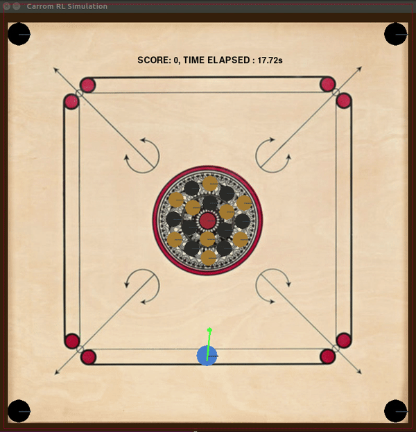

Carrom_rl
=========

A Carrom Simulator testbed for artificial intelligence .

## Introduction

This is the 0.1 release of Carrom_rl - A Carrom Simulator, which provides an interface that allows you to design agents that play single player, and two player carrom(more on this later). This is the course project for [CS 747 - Foundations of Intelligent and Learning Agents](https://www.cse.iitb.ac.in/~shivaram/teaching/cs747-a2016/index.html), taught by [Prof. Shivaram Kalyanakrishnan](https://www.cse.iitb.ac.in/~shivaram/) at IIT Bombay.

Feedback/suggestions/bugs are welcome.

## Carrom

Image Source: https://i.ytimg.com/vi/LvryHWCgK0s/maxresdefault.jpg

The objective of the game is to use a  striker disk with a flick of the finger to sink the lighter called carrom men/coins, into one of the corner pockets. A carrom set contains 19 coins in three distinct colours: white and black for the player's and red for the queen.
The aim of the game is to pocket one's own nine coins and the queen before your opponent. (The first player may only pocket white)

The full description, and list of rules and regulations can be found at http://www.carrom.org/

### Why Carrom? 

It is a challenging domain in artificial intelligence:

- The state space  is continious
- The action space is continious, with added noise
- The agent must adhere to the rules of carrom
- In the two player case, the agent must plan a strategy against an adversary, making it a multi agent system

## Rules
We slightly modify the rules of the game.

### Single Player Server

The goal of single player carrom is to design an agent, that clears the board as fast as possible, adhering to the following rules:

- Both the white and black coins are treated as the player's. Each coin pocketed increase your score by 1.
- The queen must be pocketed before the last coin.
- If all the coins are pocketed except the queen, one of the coins is taken out of the pocket and put in the center.
- After pocketing the queen, you must sink one of your pieces, thereby 'covering' it, into any pocket in the next shot, or she is returned to the center spot.
- If you pocket the queen along with another of your own piece, it is covered by default.
- A covered queen will increase your score by three points
- If the striker goes into the hole, it counts as a foul. All the pocketed coins in that turn are placed in the center. The score does not increase.

### Doubles Server

The goal of doubles is to design an agent, that wins against an opponent in a game of carrom(by pocketing his coins first), adhering to the following rules:

- The player to start/break must target white coins only. The other player must target black. Players' score increase by one when they pocket their own coin. You get to strike in alterate turn unless you pocket the queen(see below)
- If the player pockets his opponent's coin, it counts as a foul. All coins pocketed that turn are kept in the center, and the score does not increase.
- If all the coins are pocketed except the queen, the other player wins the match.
- If you manage to pocket all of your own coins, and the opponent pockets and covers the queen, you win the match.
- After pocketing the queen, you must sink one of your pieces, thereby 'covering' it, into any pocket in the next shot, or she is returned to the center spot.
- If you pocket the queen along with another of your own piece, it is covered by default.
- A covered queen will increase your score by three points
- If the striker goes into the hole, it counts as a foul. All the pocketed coins in that turn are placed in the center. The score does not increase.

## The agent and the environment

We formally define the carrom environment in the context of reinforcement learning. The State is a list of current coin positions (x,y) coordinates returned to the user. If a coin is not present, it is assumed to be pocketed in one of the previous strikes. The state also includes the current score of the player. The action is a three dimentional vector: [angle,position,force]

- angle : The angle of the striker. Accepts values in the range 0-1.25pi and 1.75pi to 2pi. 
- position: The position of 

In case problem, the server generates the action as random
Mirroring in case of 2 player

The server accepts 10^-4 units os precision in the actions. The sever also adds a gaussian noise to the actions.

## Quick Start

## Sample Agents

## What to submit?

## To Do

- Fix Theta 
- Handle exceptions on closing the connection
- Save Visualization to a file
- Running experiments in parallel
- An improved agent
- Refactoring and cleaning up code
- Ensuring that it runs on SL-2 Machines
- Add rule to not sink queen in the beginning

## License

